29, 3.5, 8.2, 9.1,

# Операционные системы UNIX/Linux (Базовый)

## Part 1. Установка ОС

Устанавливаем Ubuntu 20.04.6 Server LTS без графического интерфейса. После установки выполняем команду `cat /etc/issue`

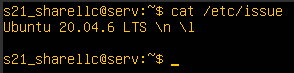

---

## Part 2. Создание пользователя

Для добавления нового пользователя выполним команду `sudo adduser [username]`

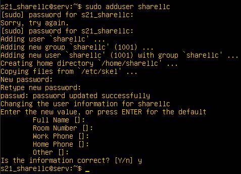

Чтобы проверить, что он появился, выполним команду `cat /etc/passwd`

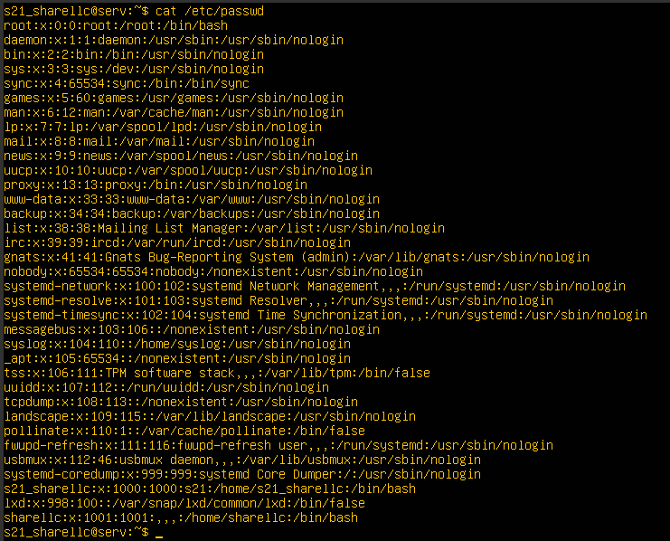

Для довавления его в группу выполним команду `sudo usermod -a -G [group] [username]`

Чтобы проверить к каким группам принадлежит пользователь, выполним команду
`id -G -n [username]`, где флаг `-n` отформатирует вывод так, чтобы показывались имена групп, а не их ID.

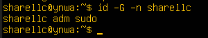

---

## Part 3. Настройка сети ОС

### Part 3.1 Изменение hostname на user-1

Задаем имя для машины: `sudo hostnamectl set-hostname user-1`. Перейдем на нового пользователя

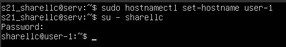

С помощью команды `hostnamectl status` можем увидеть новое название машины.

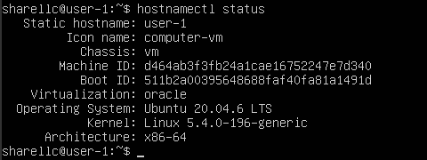

### Part 3.2 Установка временной зоны

Установить временную зону можно с помощью команды:
`timedatectl set-timezone [time zone]`
С помощью команды `timedatectl list-timezone` можно просмотреть все доступные временные зоны. Выбираем Europe/Moscow.

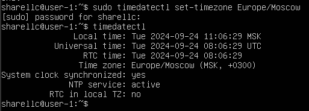

### Part 3.3 Сетевые интерфейсы

Чтобы вывести доступные сетевые интерфейсы можно воспользоваться командой
`ip link show`

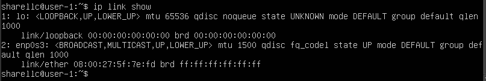

Доступные интерфейсы: lo (loopback) и enp0s3.

**loopback**:
Это виртуальный интерфейс, который существует во внутреннем стеке TCP/IP операционной системы. На практике применяется для выявления и диагностики различных проблем. Как правило, для них зарезервированы IP адреса в промежутке 127.0.0.0/8. Обычно из промежутка присваивается 127.0.0.1. Он является входной и конечной точкой связи для машины, если та отключена от любых других интерфейсов.

Таким образом, данный интерфейс нужен для того, чтобы машина могла коммуницировать сама с собой.

### Part 3.4 Получение IP адреса устройства от сервера DHCP

**DHCP**:
Dynamic Host Configuration Protocol. Используется для автоматического присваивания адреса машине. Без него администратору приходилось бы самостоятельно присваивать адреса машинам в сети. В таком случае, существует риск того, что будут допущены различные ошибки. Например: присваивание одинаковых адресов разным машинам.

Работа DHCP происходит по данной схеме:

1. Клиент посылает пакет DHCP DISCOVER, давая серверу понять, что он существует и хочет получить IP адрес. Данное сообщение отправляется по всей сети, что означает, что оно может дойти до нескольких DHCP серверов. То есть, это вещательный пакет (broadcast)
2. Сервер получает пакет и (если пакет ICMP Echo Reply не приходит, то есть если выбранный IP адрес на занят) отвечает пакетом DHCP OFFER. То есть сервер отправляет информацию о том какой адрес мог бы использовать клиент. Если не было найдено подходящего IP адреса, то DHCP сервер ждёт другого пакета DCHP DISCOVER.
3. Клиент получает пакет DCHP OFFER. Если несколько серверов ответило, то выбирается первый полученный. После этого клиент отправляет DCHP REQUEST, в котором содержится информация о выбранном DHCP сервере, а также IP адрес, который был предложен сервером.
4. Сервер получается пакет DHCP REQUEST, а затем отвечает пакетом DHCP ACK. Клиент отправляет еще один вещательный пакет DHCP ARP. Если на него не приходит ответа, то происходит присвоение адреса.

Таким образом, чтобы узнать IP адрес от DHCP сервера, необходимо найти в log файлах обращение к DHCP серверу. А конкретно результат полученного пакета DHCP ACK. Данная информация хранится в /var/log/syslog. Подойдёт команда: `cat /var/log/syslog | grep -i 'dhcp'`

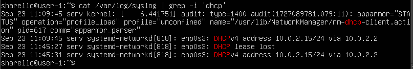

### Part 3.5 Нахождение внешнего и внутреннего адреса шлюза.

Внешний адрес шлюза можно узнать с помощью команды `wget -qO- eth0.me`

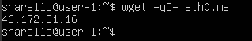

Внутренний адрес шлюза можно узнать с помощью команды `ip route | grep default`

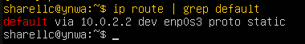

### Part 3.6 Отключение DHCP. Настройка сети.

Меняем доступ к файлу для дальнейшего его редактирования `sudo chmod 777 /etc/netplan/00-installer-config.yaml`. Для того, чтобы настроить сеть без DHCP необходимо сначала перейти в /etc/netplan. В существующем файле можно закомментировать всё, что в нём есть. Затем редактируем файл под нужные настройки используя `vim /etc/netplan/00-installer-config.yaml`

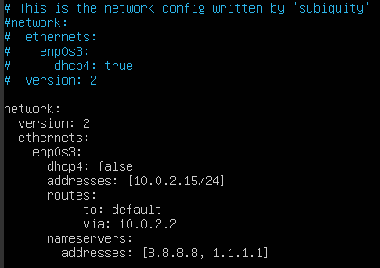

Сохраняем изменения командой `sudo netplan apply` и делаем reboot системы. Далее пропингуем ya.ru, в выводе команды должна быть фраза "0% packet loss"

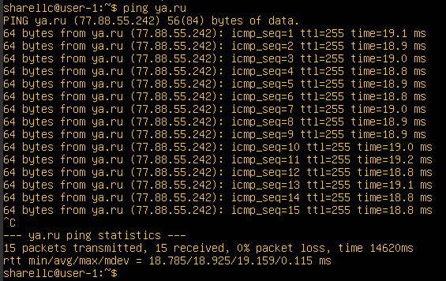

---

## Part 4. Обновление ОС

Для того, чтобы обновить ОС и установленные пакеты, будут необходимы команды `sudo apt-get update` и `sudo apt-get upgrade`. Первая команда обновляет индексовые файлы пакетов (даёт понять существуют ли новые обновления), а вторая устанавливает эти обновления. Их можно объединить: `sudo apt-get update && sudo apt-get upgrade`. Результат повторного запуска команды `sudo apt-get upgrade`

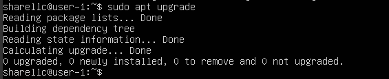

---

## Part 5. Использование команды sudo

**sudo:**
Это программа для unix подобных систем, которая позволяет от имени супер-пользователя (superuser) получать доступ к данным других пользователей, а также позволяет выполнять команды по отношению к ним.

Для того, чтобы позволить другому пользователю использовать права супер-пользователя, достаточно добавить его в группу sudo. Для этого подойдёт команда:
`sudo usermod -a -G sudo [username]`

Изменим hostname командой `sudo hostnamectl set-hostname ynwa`

Чтобы hostname изменился в терминале, необходимо перезагрузить машину.

---

## Part 6. Установка и настройка службы времени

Используем команду `date`.

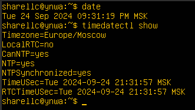

Служба NTP уже установлена. Строка NTPSynchronized=yes показывает то, что время уже синхронизировано с сервером.

---

## Part 7. Установка и использование текстовых редакторов.

Используя команду `sudo apt install mcedit`, устанавливаем текстовый редактор mcedit

### Part 7.1 test_x.txt

**Vim**
`vim test_vim.txt`. Нажимаем 'i' для перехода в режим редактирования, вводим ник, для выхода с сохранением нажимем `esc`, вводим команду `:wq` и нажимаем `enter`
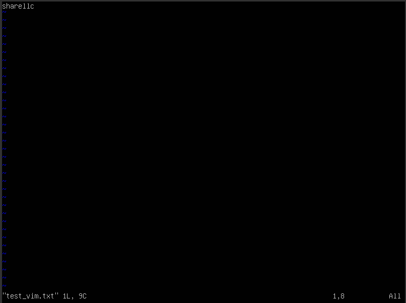

**Nano**
`nano test_nano.txt`. Вводим ник, для выхода нажимаем комбинацию `ctrl+x`, для сохранения вводим `Y` и нажимаем `enter`
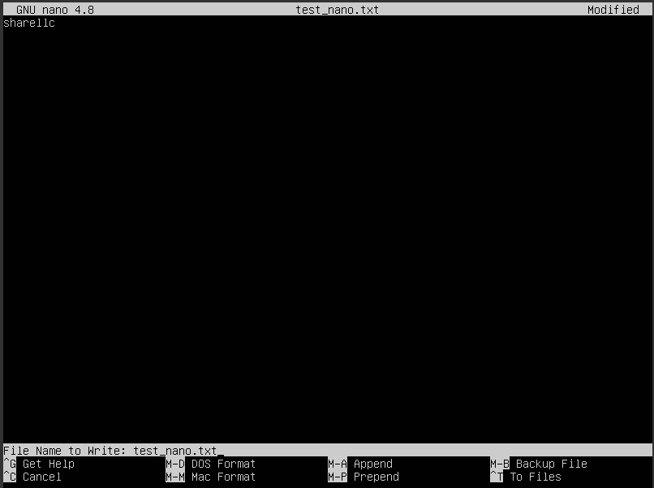

**MCEdit**
`mcedit test_mcedit.txt`. Вводим ник, для выхода с сохранением нажимаем `esc`, а затем клавишу `yes`

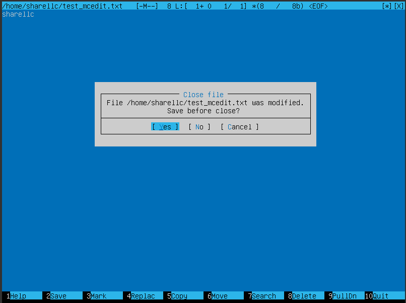

### Part 7.2 Заменить никнейм на 21 School 21. Выйти без сохранения

**Vim**
`vim test_vim.txt`. Нажимаем 'i' для перехода в режим редактирования, изменяем ник на '21 school 21', для выхода без сохранения нажимем `esc`, вводим команду `:q!` и нажимаем `enter`
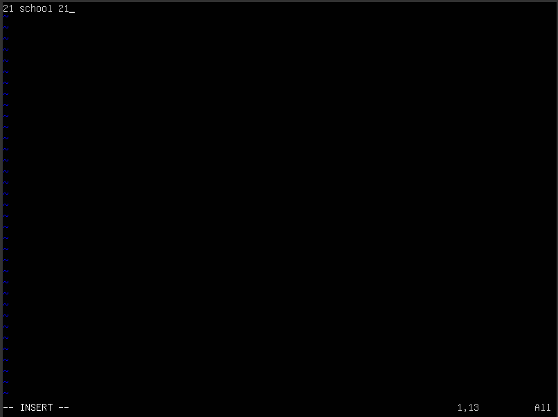

**Nano**
`nano test_nano.txt`. Изменяем ник на '21 school 21', для выхода без сохранения нажимаем комбинацию `ctrl+x`, вводим `N` и нажимаем `enter`
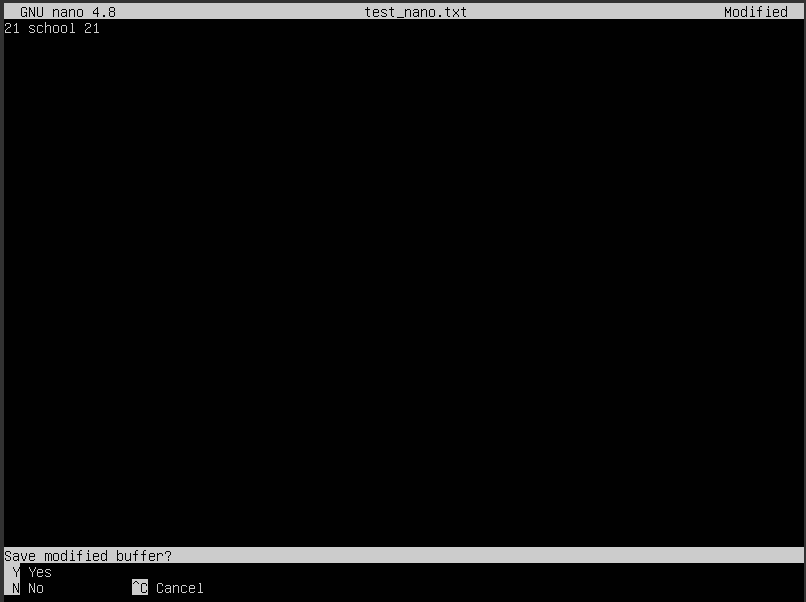

**MCEdit**
`mcedit test_mcedit.txt`. Изменяем ник на '21 school 21', для выхода без сохранения нажимаем `esc`, а затем клавишу `no`
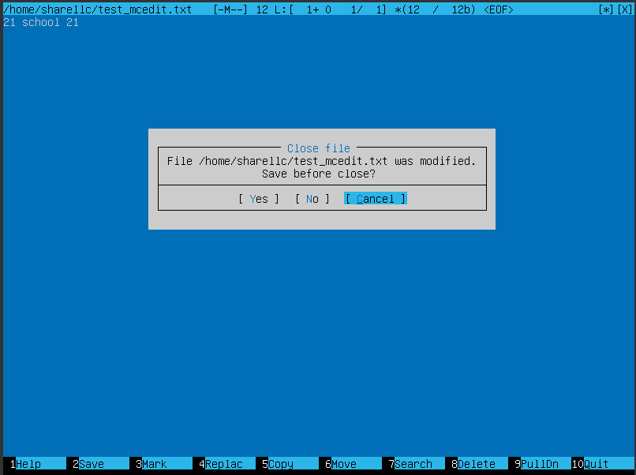

### Part 7.3 Заменить никнейм на 21 School 21 c помощью функции поиска по содержимому файла и замены слова на любое другое

**Vim**
`vim test_vim.txt`. Для поиска в VIM вводим `/sharellc` и искомое слово выделяется в самом редакторе. Для замены слова в VIM вводим `:%s/sharellc/21 School 21` и слово "sharellc" заменяется на "21 School 21"

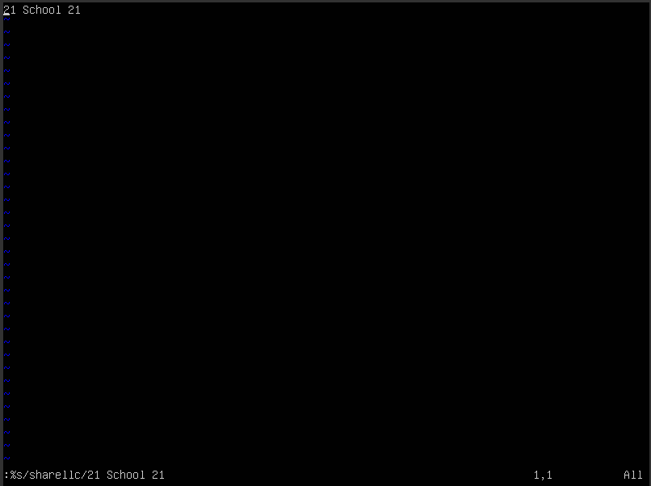

**Nano**
`nano test_nano.txt`. Для поиска в NANO вводим `ctrl + W`. Для замены слова в NANO вводим `ctrl + \`, пишем "sharellc", нажимаем `Enter`, пишем "21 School 21", нажимаем `Enter`, выбираем `Y`

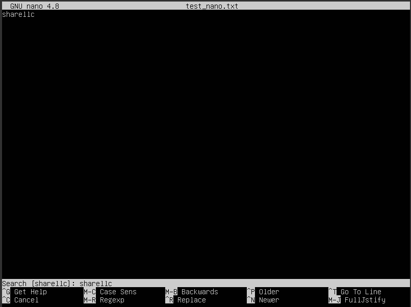
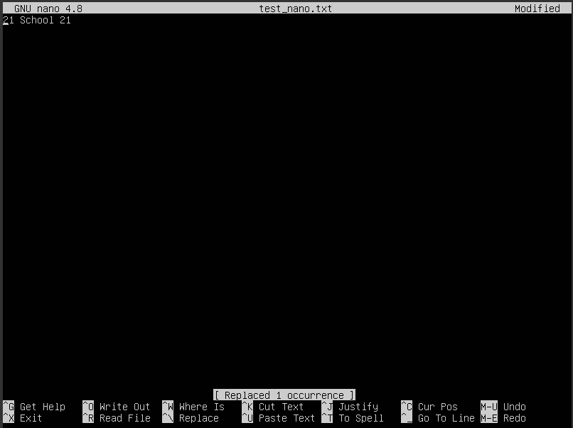

**MCEdit**
`mcedit test_mcedit.txt`. Для поиска в mcedit вводим `F7`. Для замены слова в mcedit жмем `F4`, затем вводим "sharellc", нажимаем стрелку вниз, пишем "21 School 21"

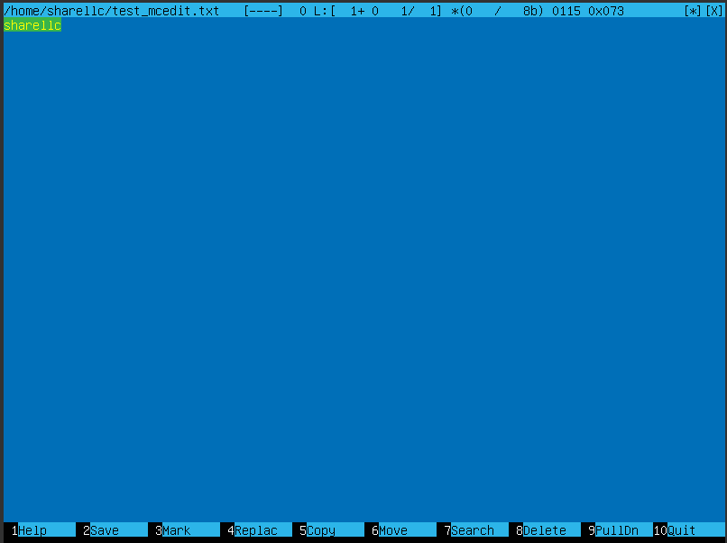

---

## Part 8. Установка и настройка службы \*\*SSHD

### Part 8.1 Установка

Проверяем наличие командой `ssh -V`. SSHD идёт вместе с SSH.

### Part 8.2 Добавление в автостарт

Добавляем автостарт службы SSHd командой `sudo update-rc.d ssh defaults`

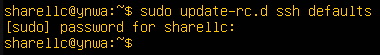

### Part 8.3 Изменение порта

Откроем файл `vim /etc/ssh/sshd_config` и поменяем порт 22 на 2022. Выйдем с сохранением

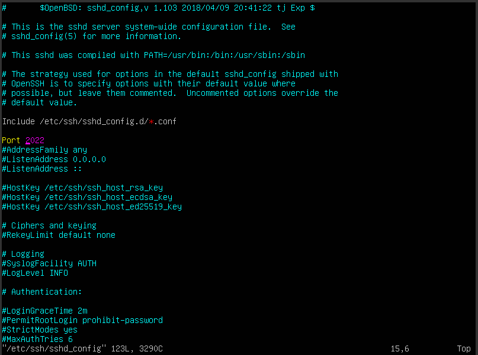

Используем команду `/etc/init.d/ssh restart` для того что бы изменения вступили в силу

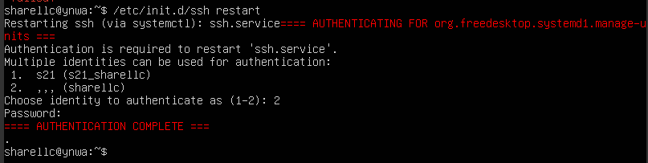

### Part 8.4 Нахождение процесса **SSHD**

Используем команду `ps -eF | grep ssh`

- -e - флаг, который позволяет просмотреть все процессы запущенные на машине. Идентично флагу -a.
- -F - флаг выводит максимум доступных данных
- | - пайп. Позволяет передать результат вывода первой команды во вторую.
- grep ssh - ищет вхождение ssh в переданном результате.

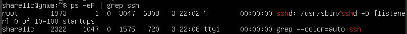

### Part 8.5 Команда **netstat**

BИсользуем команду `netstat -tan`

- Флаг -t указывает на то, что будут выбраны соединения с сокетом TCP
- Флаг -a выведет все подходящие по фильтру сокеты
- Флаг -n отформатирует адреса в числовую форму

: : :2022 равносильно 0.0.0.0:2022. То же самое касается и столбца Foreign Address. Можно подумать, что SSH слушает только через IPv6, но когда адрес забит 0, то это позволяет отлавливать IPv4 пакеты через сокеты IPv6.

**0.0.0.0** определяет блок всех возможных IP адресов.

---

## Part 9. Установка и использование утилит **top** и **htop**

### Part 9.1 **Top**

Запускаем утилиту командой `top`

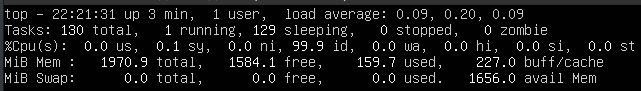

- Uptime: 3 минуты
- Авторизированные пользователи: 1
- Средняя загруженность системы: 0.09
- Общее кол-во процессов: 130
- Общая загрузка CPU: 0.0%
- Общая загрузка памяти: 159.7 MiB

`top -o %MEM`

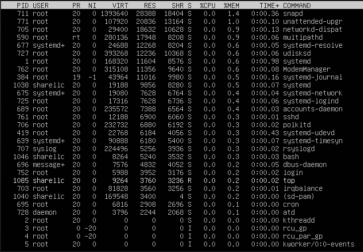

- **PID** процесса, занимающего больше всего памяти: 711

`top -i TIME+`

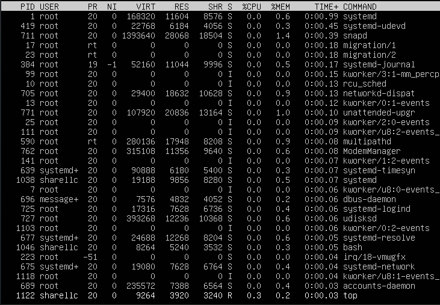

- **PID** процесса, занимающего больше всего процессорного времени: 1

### Part 9.2 **htop**

Запустив htop командой `htop`, а затем нажав F6, можно выбрать по какому пункту сортировать.

По **PID**:

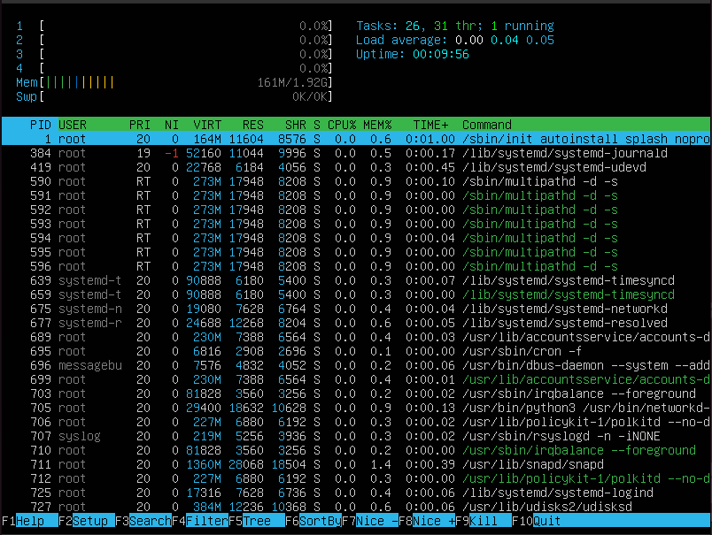

Для выбора того, как проводить сортировку нажимаем `F6`. По **PERCENT_CPU**:

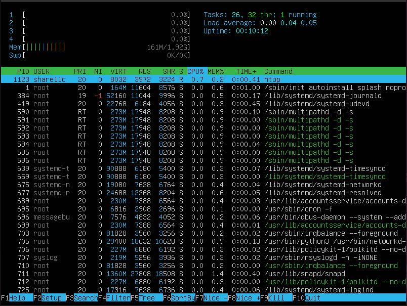

По **PERCENT_MEM**:

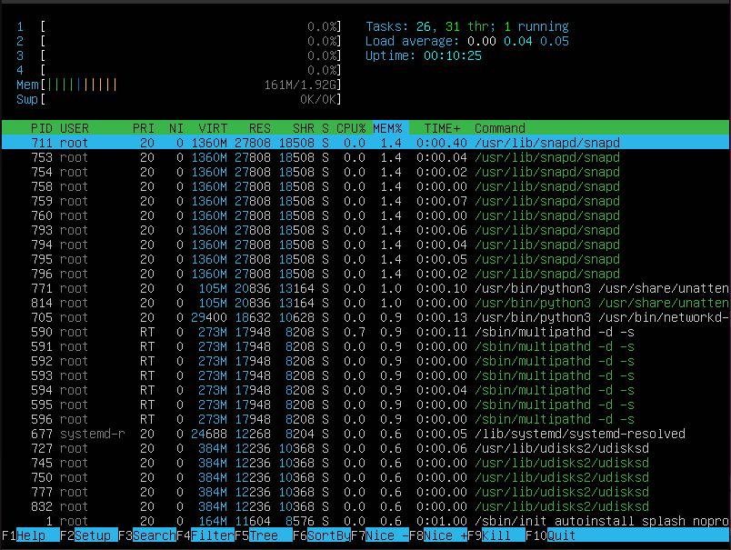

По **TIME**:

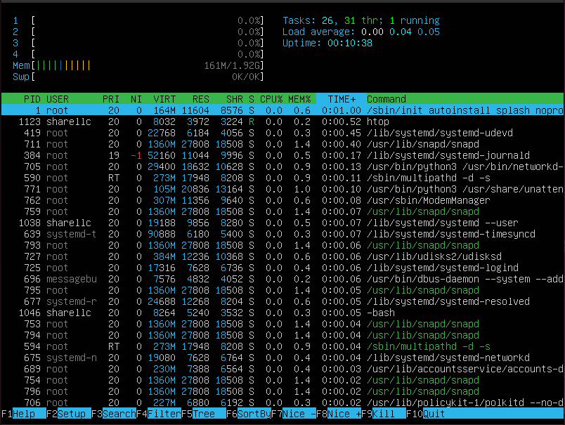

Для работы с фильтром нажимаем `F4`. По процессу **SSHD**:

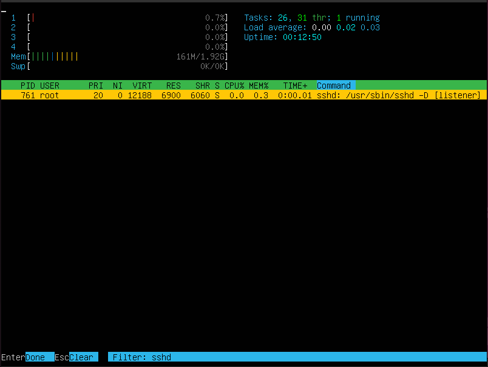

Для работы с поиском нажимаем `F3`. **syslog**:

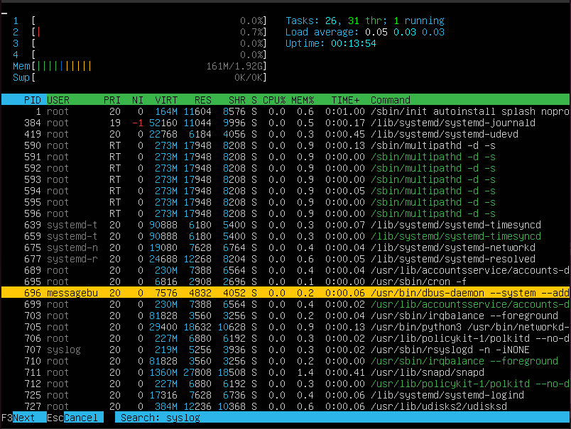

Вывод htop с добавленными метриками **hostname, clock и uptime**:

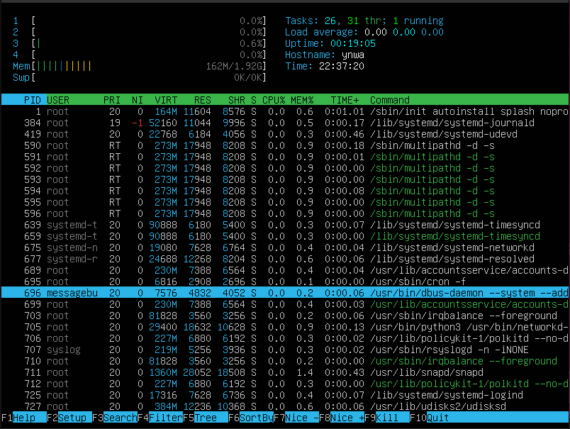

Выход `F10`

---

## Part 10. Утилита **fdisk**

Запуск утилиты командой `sudo fdisk -l`

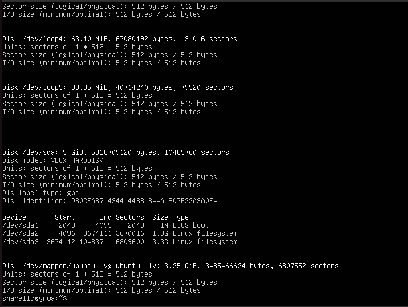

- Название диска: VBOX HARDDISK (/dev/sda).
- Размер: 5 GiB (5368709120 байтов)
- Количество секторов: 10485760

Используем команду `free -h` для определения размера swap файла (swap нет)

---

## Part 11. Утилита **df**

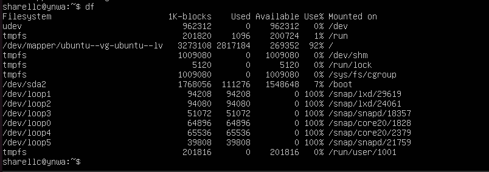

- Размер (/) : 1768056 Kib
- Размер занятого пространства (/) : 111276 Kib
- Размер свободного пространства (/) : 1548648 Kib
- Процент использования (/) : 7%

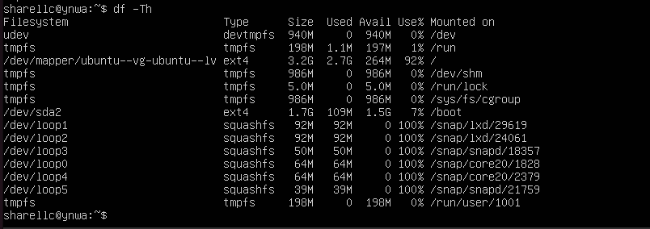

- Размер (/) : 1.7 Gb
- Размер занятого пространства (/) : 109 Mb
- Размер свободного пространства (/) : 1.5 Gb
- Процент использования (/) : 7%
- Тип файловой системы: ext4

---

## Part 12. Утилита **du**

С помощью команды `sudo du -sb /home && sudo du -sb /var && sudo du -sb /var/log` выводим размер папок в байтах

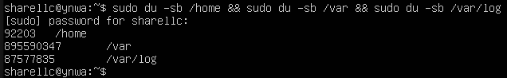

С помощью команды `sudo du -sbh /home && sudo du -sbh /var && sudo du -sbh /var/log` выводим размер папок в человеко-читаемом формате

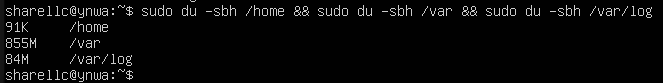

C помощью команды `sudo du -h /var/log/*` для вывода всего содержимого /var/log в человекочитаемом формате.

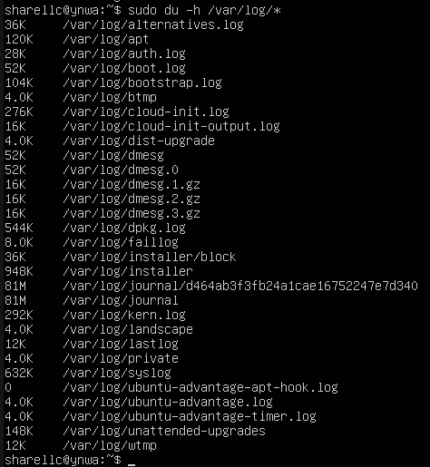

---

## Part 13. Установка и использование утилиты **ncdu**

Командой `sudo apt install ncdu` устанавливаем ncdu. Выводим размер папок с помощью команды `sudo ncdu` /home, /var, /var/log

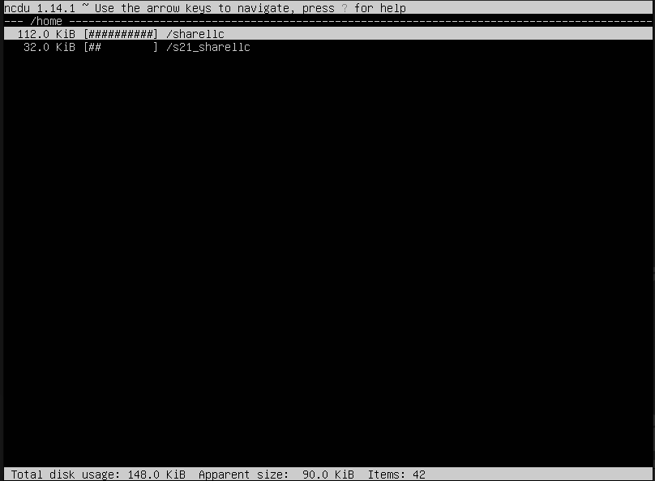

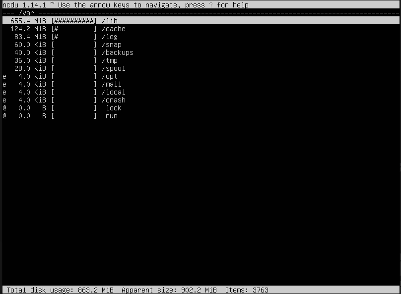

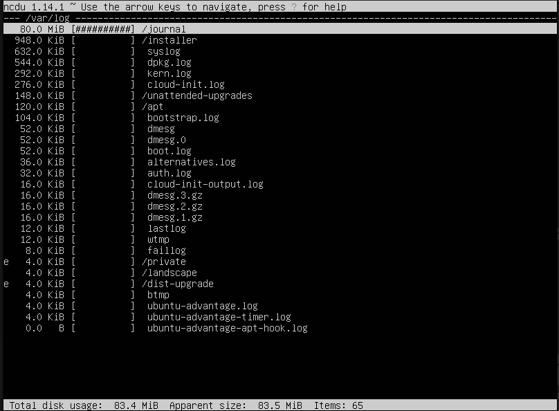

## Part 14. Работа с системными журналами

Откроем для просмотра `dmesg`, `syslog`, `auth.log`

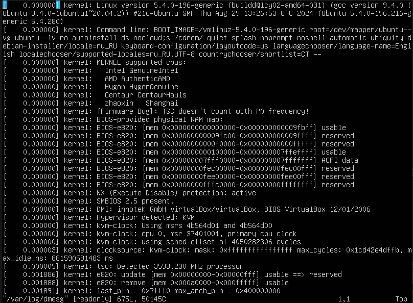

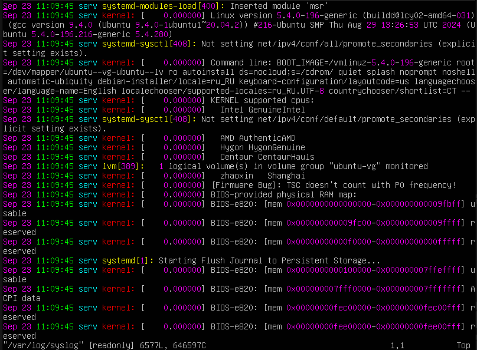

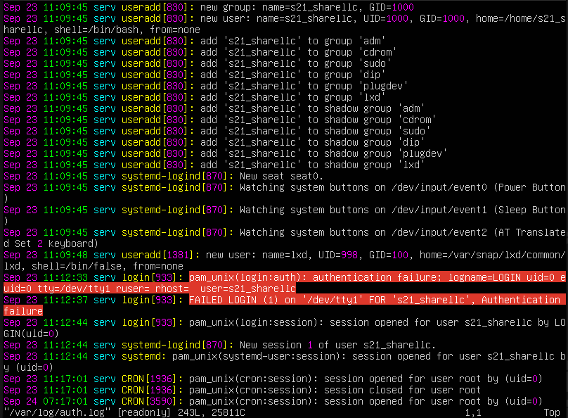

Для просмотра последней авторизации, имени пользователя и метода входа в систему используем команду `last`

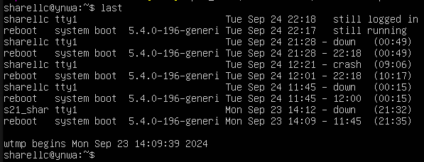

- Время авторизации Sep 24 22:18
- Имя пользователя sharellc
- Метод входа в систему tty1

Команда для рестарта: `sudo systemctl restart sshd`. Откроем syslog с помощью команды `cat syslog`. В конце будут сообщение о том, что ssh останавливается, а затем снова запускается.

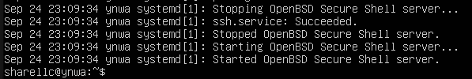

---

## Part 15. **CRON**

Используем команду `sudo apt install cron` для установки **CRON**. Планируем задачу командой `crontab -e`. В vim приписываем `*/2 * * * * uptime`, сохраняем

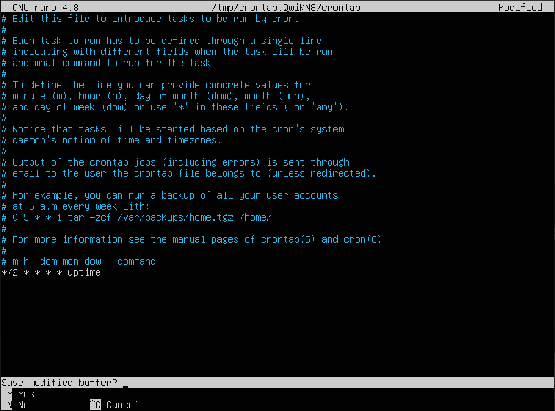

Откроем `syslog` для просмотра системных задач

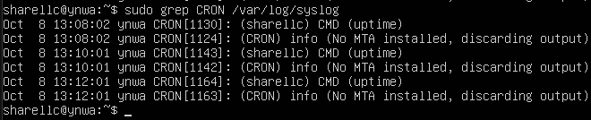

Командой `crontab -r` удаляем все запланированые задачи

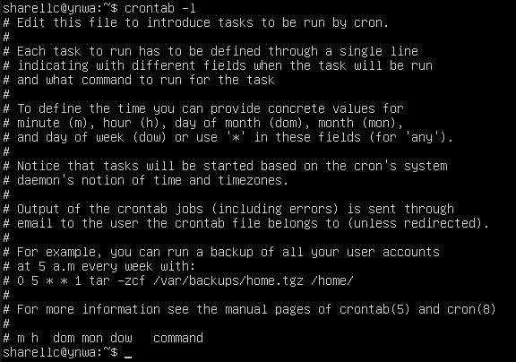

---
